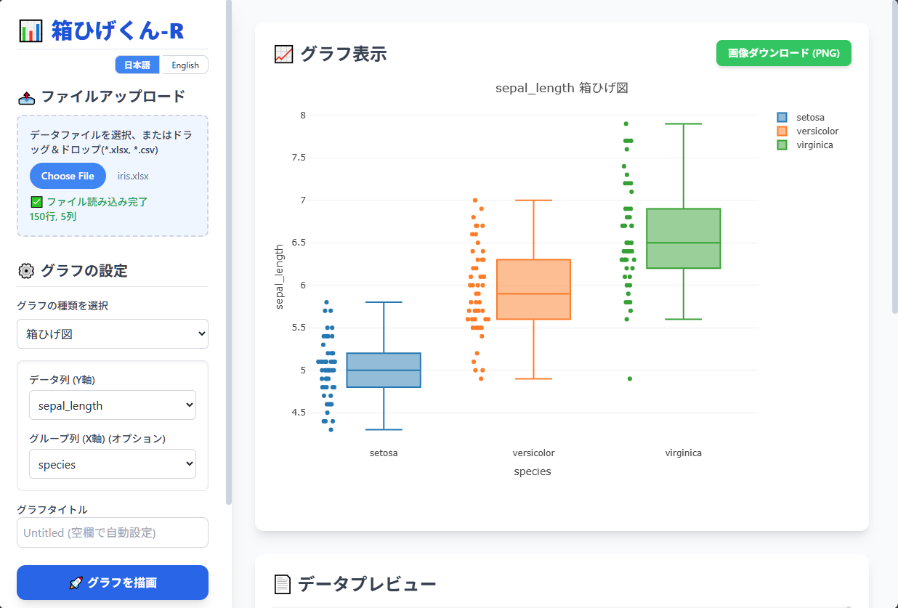

# 📊 箱ひげくん-R (HakoHigeKun-R) - Instant Offline Box-and-Whisker Plotter

**Drag & Drop → Instant Box Plot.**  
**See your first numeric column as a box plot immediately—no clicks, no setup, no servers.**

**HakoHigeKun-R** is an offline-first web app that lets QC engineers, data analysts, and students visualize their data instantly—no setup, no server, no cloud upload. Just drag a CSV or Excel file, and the first numeric column is automatically plotted as a Box-and-Whisker Plot.

**Why the name?**

- **Hako**: Japanese for "箱（はこ）", also English "Box"  
- **Hige**: Japanese for "髭（ひげ）", also English "Whisker"  
- Together: **Box-and-Whisker Plot**.  
- **-R**: It might stand for **"Regular"**, or maybe not. Who knows?  Makes it more interesting, doesn’t it? You can imagine many possible meanings over time - like what if it were **B**, **S**, **M**, **L**, **X**, or **Z** instead? Just have fun with it.

**What it can do**

Beyond instant box plots, **HakoHigeKun-R** also provides simple statistical charts useful for quality control:  

- **Pareto Chart**: Quickly spot the vital few factors.  
- **X-Rs Control Chart**: Monitor process stability over time.



## Key Features

- **Instant Visualization**: Drop a file and get a box plot from the first numeric column—no extra setup needed.
- **Offline & Private**: Works completely in your browser. Your data never leaves your PC.
- **Supports CSV & Excel**: Handles common file formats effortlessly.
- **Interactive Charts**: Zoom, pan, hover, and explore your data with `Plotly.js`.
- **Simple & Focused**: Designed to show the most essential QC graphs quickly.


## Supported Chart Types

| Chart Type | Quick Description |
| --- | --- |
| **Box Plot** | Auto-plots first numeric column; shows spread, skewness, and outliers. |
| **Histogram** | Analyze distribution and central tendency. |
| **Scatter Plot** | Explore relationships between two columns (optional grouping). |
| **Pareto Chart** | Quickly identify top contributors (80/20 rule). |
| **Control Charts (X-Rs)** | Monitor process stability over time. |

> The magic of **HakoHigeKun-R**: drag your data and instantly see patterns — no clicks, no configuration. Of course, if you’d like to explore a bit deeper, clicks and tweaks await you too.

## How to Use

1. **Download**: Clone or download this repository (or just `index.html` and `libs/` folder).
2. **Open**: Open `index.html` in any modern browser.
3. **Drag & Drop**: Drop your CSV or Excel file into the app.
4. **Instant Box Plot**: The first numeric column is automatically selected and visualized.
5. **Explore More**: Optionally, pick different columns or chart types from the sidebar for further analysis.

## Limitations and Known Issues

🚧 Due to its focus on simplicity and offline operation, **HakoHigeKun-R** has some limitations regarding advanced features.

1. **Single Grouping Column Only**
    * For Box Plots and other charts that perform grouping, **only a single column can be designated as the grouping variable.**
    * Complex multi-grouping (e.g., combining "Region" and "Gender" columns) is **not currently implemented.**
2. **Large Datasets**
    * Since the application is dependent on browser memory, handling very large datasets (tens of thousands of rows or more) may result in reduced performance or potential loading failures.

## Project Structure

```bash
.
├── index.html              # Main app
├── index-standalone.html   # Bundled Online and StandAlone version
├── libs/                   # Libraries (Plotly.js, PapaParse, etc.)
├── LICENSE                 # MIT License
├── README.md               # This file
└── NOTICE.txt              # Third-party notices
```


## Technology Stack

**HakoHigeKun-R** is built on robust, open-source web technologies:

- [Tailwind CSS](https://tailwindcss.com/): For clean, modern styling.
- [Plotly.js](https://plotly.com/javascript/): The powerful engine for creating professional, interactive charts.
- [PapaParse](https://www.papaparse.com/): Fast and reliable CSV parsing.
- [SheetJS/xlsx](https://sheetjs.com/): For robust Excel file (XLSX) parsing.


## License

This project is licensed under the MIT License (see [LICENSE](./LICENSE)).

It also includes the following third-party libraries under MIT-compatible terms:
Tailwind CSS, Plotly.js, PapaParse, and SheetJS/xlsx (Community Edition).
See [NOTICE.txt](./NOTICE.txt) for details.

