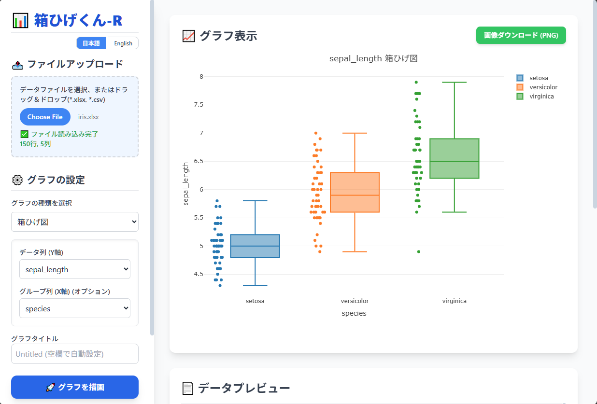

# 📊 箱ひげくん-R (HakoHigeKun-R) - Your Personal Offline Box-and-Whisker Plotter for Seeing What’s Hidden

**Drag & Drop → Instant Box Plot.**  
**See your first numeric column as a box plot immediately — no setup, no servers.**



**HakoHigeKun-R** is an offline-first web app that lets QC engineers, data analysts, and students visualize their data instantly—no setup, no server, no cloud upload. Just drag a CSV or Excel file, and the first numeric column is automatically plotted as a Box-and-Whisker Plot.

**Why the name?**

- **Hako**: Japanese for "箱（はこ）", also English "Box"  
- **Hige**: Japanese for "髭（ひげ）", also English "Whisker"  
- Together: **Box-and-Whisker Plot**.  
- What Does the **R** Mean?: It might stand for **"Regular"**, or maybe not. Who knows?  Makes it more interesting, doesn’t it? You can imagine many possible meanings over time - like what if it were **B**, **S**, **M**, **L**, **X**, or **Z** instead? Just have fun with it.

**What it can do**

Beyond instant box plots, **HakoHigeKun-R** also provides simple statistical charts useful for quality control:  

- **Pareto Chart**: Quickly spot the vital few factors.  
- **X-Rs Control Chart**: Monitor process stability over time.

## 📘 What Is a Box-and-Whisker Plot?

A **Box-and-Whisker Plot** (箱ひげ図) is a simple yet powerful way to visualize how your data is spread out and where it tends to cluster.
It summarizes a dataset using **five key values** — and each part of the chart has a clear meaning:

| Part | Name | Meaning |
| ---- | --------------- | ---- |
| ▒    | **Box (IQR)**   | The middle 50% of your data (from the 1st to 3rd quartile). It shows how wide your data spreads around the median. |
| ─    | **Median line** | The middle value of your data — half of the data is above, and half is below this line.                            |
| ──   | **Whiskers**    | Extend from the box to show the overall range, excluding extreme outliers.                                         |
| ●    | **Outliers**    | Data points that lie unusually far away from the rest — they deserve attention!                                    |

A **wide box** means your data varies a lot (large spread). A **narrow box** means most values are similar. When the median is closer to one side, it indicates **skewness** — your data leans toward higher or lower values.

> Think of it as a small story about your data: where the center lies, how consistent it is, and whether there are any surprises.

**Example**

Here’s how to interpret a simple example:

```plaintext
     ┌───────┬───────┐
  ───┘       │       └───
   10       20       30
```

* **Median = 20**  → half the values are below 20, half are above.
* **Box (10–30)**  → the middle 50% of data lies between 10 and 30.
* **Whiskers** show the minimum and maximum (or near-min/max) values.

**Why Use It?**

Box-and-Whisker plots help you:

* Spot **outliers** easily.
* Compare **distributions** between groups.
* Understand **data spread** without seeing every point.

Even beginners can gain quick insight into whether a process is stable, variable, or unusual.

**In HakoHigeKun-R**

When you drop your data, the app instantly creates a box plot from the first numeric column — giving you a snapshot of how your data behaves.
In **Learning Mode**, each box element can be highlighted interactively so you can explore these concepts visually.

## How to Use

Using HakoHigeKun-R couldn't be simpler, as it runs entirely in your local browser environment.

1. **Get the Code**: **Clone or download this repository** (or just ensure you have `index.html` and the `libs/` directory).
2. **Open the App**: Simply **double-click `index.html`** to open the application in your default web browser.
3. **Analyze Data**: Drag your CSV or Excel file directly into the application window. The box plot will appear instantly.
4. **Explore More**: Optionally, use the sidebar to select different columns or chart types.

## Key Features

- **Instant Visualization**: Drop a file and get a box plot from the first numeric column.
- **Offline & Private**: Works completely in your browser. Your data never leaves your PC.
- **Supports CSV & Excel**: Handles common file formats effortlessly.
- **Interactive Charts**: Zoom, pan, hover, and explore your data with `Plotly.js`.
- **Simple & Focused**: Designed to show the most essential QC graphs quickly.


## Supported Chart Types

| Chart Type | Quick Description |
| --- | --- |
| **Box Plot** | Auto-plots first numeric column; shows spread, skewness, and outliers. |
| **Histogram** | Analyze distribution and central tendency. |
| **Scatter Plot** | Explore relationships between two columns (optional grouping). |
| **Pareto Chart** | Quickly identify top contributors (80/20 rule). |
| **Control Charts (X-Rs)** | Monitor process stability over time. |

> The magic of **HakoHigeKun-R**: drag your data and instantly see patterns — no clicks, no configuration. Of course, if you’d like to explore a bit deeper, clicks and tweaks await you too.

## How to Use

1. **Download**: Clone or download this repository (or just `index.html` and `libs/` directory).
2. **Open**: Open `index.html` in any modern browser.
3. **Drag & Drop**: Drop your CSV or Excel file into the app.
4. **Instant Box Plot**: The first numeric column is automatically selected and visualized.
5. **Explore More**: Optionally, pick different columns or chart types from the sidebar for further analysis.

## Limitations and Known Issues

🚧 Due to its focus on simplicity and offline operation, **HakoHigeKun-R** has some limitations regarding advanced features.

1. **Large Datasets**
    * Since the application is dependent on browser memory, handling very large datasets (tens of thousands of rows or more) may result in reduced performance or potential loading failures.

## Project Structure

```bash
.
├── index.html              # Main application
├── index-online.html       # Experimental version with Pair Plot (requires internet connection)
├── libs/                   # External libraries (Plotly.js, PapaParse, etc.)
├── LICENSE                 # MIT license
├── README.md               # Project documentation
└── NOTICE.txt              # Third-party license notices
```


## Technology Stack

**HakoHigeKun-R** is built on robust, open-source web technologies:

- [Tailwind CSS](https://tailwindcss.com/): For clean, modern styling.
- [Plotly.js](https://plotly.com/javascript/): The powerful engine for creating professional, interactive charts.
- [PapaParse](https://www.papaparse.com/): Fast and reliable CSV parsing.
- [SheetJS/xlsx](https://sheetjs.com/): For robust Excel file (XLSX) parsing.

## Sample Penguins data reference

> Horst AM, Hill AP, Gorman KB (2020). palmerpenguins: Palmer Archipelago (Antarctica) penguin data. R package version 0.1.0. https://allisonhorst.github.io/palmerpenguins/. doi: 10.5281/zenodo.3960218.

## License

This project is licensed under the MIT License (see [LICENSE](./LICENSE)).

It also includes the following third-party libraries under MIT-compatible terms:
Tailwind CSS, Plotly.js, PapaParse, and SheetJS/xlsx (Community Edition).
See [NOTICE.txt](./NOTICE.txt) for details.

